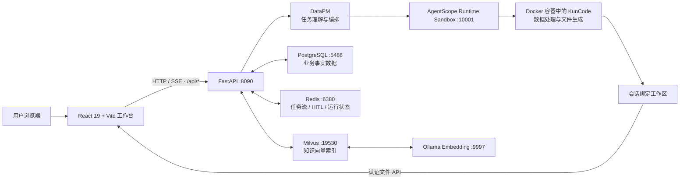
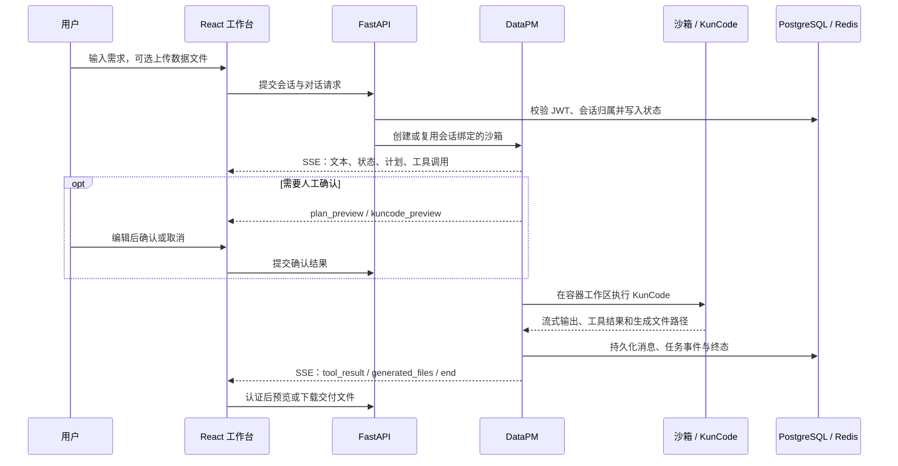

# DataAgent

> 面向企业数据分析场景的全栈智能体平台：将自然语言需求转化为可确认、可追踪、在隔离沙箱中执行的数据任务。

DataAgent 让用户通过对话上传数据、描述分析目标，并在同一工作台中查看计划、执行过程、生成文件和最终结果。系统由 DataPM 负责理解和编排任务，由 KunCode 在 Docker 沙箱中完成数据处理、分析和报告生成。

| 文档入口 | 说明 |
| --- | --- |
| [项目文档索引](docs/README.md) | 规划、整改和验收记录。 |
| [运行与协作基线](AGENTS.md) | 当前架构、端口、数据边界、开发与验收要求。 |
| [默认系统提示词](system_prompt.md) | DataPM 的默认行为约束。 |

---

## ✨ 核心价值

- **自然语言驱动分析**：把“清洗这份销售数据并生成趋势报告”转化为受控的分析任务。
- **过程可见且可控**：以 SSE 流式展示思考、计划、工具调用与执行结果，并在关键步骤引入人工确认。
- **执行环境隔离**：用户任务代码和 KunCode 在 Docker 容器中运行，主机只负责调度、状态管理和交付。
- **会话级工作区**：上传文件、执行上下文和生成文件按会话绑定，统一通过鉴权 API 访问。
- **可扩展能力平台**：知识库、Agent、Skill、MCP 与系统提示词可在管理后台维护，并注入沙箱运行时。

## 🧩 功能概览

| 模块 | 主要能力 |
| --- | --- |
| 对话工作台 | 登录、会话管理、流式回答、任务状态、工具终端、计划和文件三态面板。 |
| 数据分析执行 | 在沙箱中执行数据清洗、统计分析、相关性/聚类/贡献度等任务，生成图表与报告。 |
| Human-in-the-Loop | 支持计划预览、KunCode 任务描述预览、编辑确认、取消、超时与中断处理。 |
| 文件交付 | 上传文件、浏览工作区、预览/编辑文本内容、下载单个文件或整个工作区 ZIP。 |
| 知识库 | 在 PostgreSQL 保存正文，在 Milvus 保存可重建向量索引，用于知识检索增强。 |
| 管理后台 | 管理知识库、系统提示词、Agent、Skill、MCP 及其沙箱注入。 |

---

## 🏗️ 当前系统架构



### 组件职责

| 层级 | 当前实现 | 职责 |
| --- | --- | --- |
| 前端 | React 19、TypeScript、Vite、Zustand、Tailwind CSS | 对话、会话、SSE 状态、计划/文件/终端面板与管理后台。 |
| API | FastAPI、Pydantic Settings、Tortoise ORM | JWT 鉴权、领域 API、SSE、健康检查和 React 生产构建产物托管。 |
| 智能体 | AgentScope、DataPM | 需求理解、上下文管理、工具选择、计划生成与任务编排。 |
| 执行 | AgentScope Runtime、KunCode、Docker | 会话级隔离执行、数据处理、文件生成和流式结果返回。 |
| 存储 | PostgreSQL、Redis、Milvus、Ollama | 业务事实、运行状态、可重建向量索引与 Embedding。 |

---

## 🔄 一次任务如何完成



### 关键流程说明

1. 用户登录后，前端保存 JWT 并加载可访问的历史会话。
2. 上传文件与当前用户、会话和沙箱绑定关系关联；所有文件访问经过后端权限校验。
3. `POST /api/conversation/chat` 用于直接 SSE 对话。长任务可使用 `POST /api/conversation/async` 提交，并从 `GET /api/conversation/stream/{task_id}` 恢复订阅。
4. `execution_mode=auto` 由 DataPM 判断是否调用工具；`execution_mode=kuncode` 则直接进入 KunCode 执行路径。
5. 复杂任务可以先给出计划，或在执行前展示可编辑的 KunCode 任务描述。只有确认后才继续执行。
6. KunCode 在 Docker 沙箱的会话工作区中运行；服务端只将相对工作区路径以 `generated_files` 事件通知前端。
7. 正常、失败和中断路径都会写入明确终态，避免界面永久显示“执行中”。

### SSE 事件契约

前后端共享 `frontend/src/types/index.ts` 中的流式事件定义。常见事件包括：

`text`、`thinking`、`status`、`tool_call`、`tool_result`、`plan`、`plan_preview`、`kuncode_preview`、`generated_files`、`error`、`interrupted` 和 `end`。

同一次工具调用通过稳定的 `tool_id` 关联 `tool_call` 与 `tool_result`，前端据此原位更新终端记录，避免重复渲染。

---

## 🔐 数据与安全边界

| 资源 | 事实来源与访问方式 |
| --- | --- |
| PostgreSQL | 用户、会话、消息、知识正文、系统提示词、Agent/Skill/MCP 元数据、文件元数据与沙箱绑定的业务事实来源。 |
| Redis | 任务流、HITL 确认、活跃任务和可重放运行事件；不是长期业务数据的唯一来源。 |
| Milvus | 从 PostgreSQL 知识正文构建的派生向量索引，可重建。 |
| 会话工作区 | 上传和生成文件的运行期位置；通过鉴权 API 浏览、预览和下载，不直接暴露宿主机绝对路径。 |
| Docker 沙箱 | 用户代码、Shell 和 KunCode 的执行边界；不允许让模型生成的命令直接在宿主机运行。 |

Milvus 或 Embedding 不可用时，知识库功能会降级；基础对话不应因此被阻断。`.env`、`sandbox.env` 中的 API Key、Token 和密码不得写入源码、文档、日志或提交记录。

---

## 🛠️ 技术栈

| 分类 | 技术 |
| --- | --- |
| 前端 | React 19、TypeScript、Vite 8、Zustand、Tailwind CSS、React Markdown。 |
| 后端 | Python 3.12+、FastAPI、Tortoise ORM、asyncpg、Redis asyncio、Pydantic Settings。 |
| 智能体与执行 | AgentScope、AgentScope Runtime、KunCode、Docker Desktop。 |
| 数据服务 | PostgreSQL 16、Redis 7、Milvus 2.5、Ollama `qwen3-embedding:0.6b`。 |
| 文件能力 | SheetJS、Mammoth、pdf.js、PptxJS、JSZip。 |

模型层支持 DeepSeek、MiniMax、OpenAI、Anthropic 与 Mimo；实际提供商、模型和密钥均从 `.env` 读取。

---

## 🚀 本地运行（Windows 主线）

项目当前以 **Windows 宿主机 + Docker Desktop** 为主运行环境：主服务和 Sandbox Manager 由 PowerShell 脚本管理，PostgreSQL、Redis、Milvus 和隔离容器由 Docker 提供。

### 前置条件

- Python 3.12+、Node.js、`uv`、Docker Desktop。
- PostgreSQL 与 Redis 已按 `.env` 配置启动；当前本地运行基线使用 PostgreSQL `5488`、Redis `6380`。
- 首次执行代码任务前已构建 `data_analysis` 沙箱镜像。
- Milvus 与 Ollama Embedding 为知识库链路所需组件；其不可用会在健康检查中显示为降级。

### 首次安装

```powershell
cd E:\Full_Stack_Challenge\dataagent

# 后端依赖
uv sync

# 前端依赖与生产构建
cd frontend
npm.cmd ci
npm.cmd run build
cd ..

# 本地配置：填写数据库、模型与沙箱配置，切勿提交
Copy-Item .env.example .env
```

首次构建隔离沙箱镜像：

```powershell
.\.venv\Scripts\runtime-sandbox-builder.exe data_analysis `
  --dockerfile_path .\sandbox_image\Dockerfile `
  --extension .\data_analysis_sandbox.py
```

### 启动、查看与停止

```powershell
# 启动依赖服务
docker start data_analysis_postgres data_analysis_redis
docker compose -f .\milvus\docker-compose.yml up -d

# 启动 Sandbox Manager 与 FastAPI
.\scripts\start.ps1 -Action up

# 服务状态与日志
.\scripts\start.ps1 -Action status
.\scripts\start.ps1 -Action logs -Service main
.\scripts\start.ps1 -Action logs -Service sandbox

# 重启或停止脚本管理的服务
.\scripts\start.ps1 -Action restart
.\scripts\start.ps1 -Action down
```

- 应用入口：[http://127.0.0.1:8090](http://127.0.0.1:8090)
- FastAPI 文档：[http://127.0.0.1:8090/docs](http://127.0.0.1:8090/docs)
- 健康检查：[http://127.0.0.1:8090/ready](http://127.0.0.1:8090/ready)

生产模式下 FastAPI 提供 `frontend/dist`。前端变更后必须重新运行 `npm.cmd run build`。

### 前端开发模式

后端保持在 `8090` 运行，再启动 Vite：

```powershell
cd frontend
npm.cmd run dev
```

Vite 会将 `/api` 和 `/ready` 代理至 `8090`。

---

## ✅ 健康检查与验证

```powershell
Invoke-RestMethod http://127.0.0.1:8090/ready | ConvertTo-Json -Depth 4
Invoke-WebRequest http://127.0.0.1:9091/healthz
Invoke-RestMethod http://127.0.0.1:9997/v1/models
```

`/ready` 将 PostgreSQL、Redis 和 Sandbox 作为基础可用性依赖；Milvus 与 Embedding 可以显示 `degraded`，表示知识库链路受限，而非基础对话必然不可用。

最低回归验证：

```powershell
.\.venv\Scripts\python.exe -m unittest tests.test_task_regressions -v

cd frontend
npm.cmd run lint
npm.cmd run build
```

涉及对话、KunCode、文件或管理后台的改动，还应完成：登录 → 创建会话 → 真实接口调用 → 检查终态 → 从文件面板打开或下载实际产物。

---

## 📁 关键目录

```text
dataagent/
├── app/
│   ├── api/                 # 认证、会话、对话、文件、计划、知识库与沙箱管理 API
│   ├── models/              # Tortoise ORM 模型
│   ├── repositories/        # PostgreSQL 数据访问层
│   ├── services/            # Agent、模型、沙箱注入、清理与业务编排
│   ├── main.py              # FastAPI 入口、健康检查与 SPA 托管
│   └── tasks.py             # Windows / Celery 长任务执行策略
├── frontend/src/
│   ├── admin/               # 管理后台
│   ├── components/          # 认证、聊天、布局和右侧面板
│   ├── stores/              # 认证、会话、SSE 任务和 UI 状态
│   └── types/               # 事件与领域类型契约
├── sandbox_image/           # 数据分析容器镜像定义
├── sandbox_skills/          # 可注入的内置 Skill 与资源
├── milvus/                  # Milvus Docker Compose 配置
├── scripts/start.ps1        # Windows 服务生命周期脚本
├── docs/                    # 规划、整改与验收记录
├── system_prompt.md         # DataPM 默认系统提示词
└── AGENTS.md                # 当前运行与开发约束基线
```

---

## 🎤 面试速览

可以用下面这段介绍项目：

> DataAgent 是一个将自然语言数据需求转化为受控沙箱任务的全栈智能体平台。前端使用 React 通过 SSE 展示任务过程，FastAPI 负责鉴权、会话、任务流和文件交付；DataPM 负责需求理解与工具编排，KunCode 在会话绑定的 Docker 沙箱中完成实际分析。PostgreSQL 保存业务事实，Redis 支撑可恢复任务流和人工确认，Milvus 提供可重建的知识库向量检索，从而兼顾易用性、可追踪性和执行隔离。

建议按以下顺序熟悉项目：

1. 本 README：项目目标、架构、核心流程与运行方式。
2. [AGENTS.md](AGENTS.md)：端口、事件协议、数据所有权和验收要求。
3. `app/services/agent_service.py` 与 `app/tasks.py`：智能体、沙箱和长任务关键实现。
4. `frontend/src/stores/session.ts` 与 `frontend/src/types/index.ts`：SSE 如何驱动前端状态。
5. [docs/README.md](docs/README.md)：历次优化、整改与验收记录。

## License

MIT License
