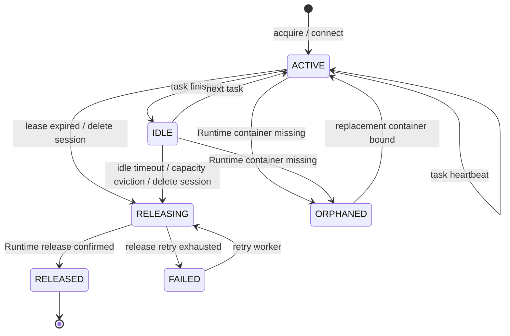

# 沙箱容器回收与清理设计方案

> 状态：待实施  
> 编制日期：2026-07-23  
> 适用范围：AgentScope Runtime、`data_analysis` 沙箱、KunCode、会话文件工作区  
> 目标：保证“一个会话至多绑定一个可验证的沙箱”，限制容器总量，并在会话结束、空闲超时、服务重启或异常遗留后可靠回收容器和工作区。

## 1. 背景与问题

当前 `data_analysis` 沙箱按会话创建 Docker 容器。`POOL_SIZE=2` 只表示启动时预热两个可复用容器，不是容器数上限；不同会话、会话映射失效或服务重启后都可能继续创建新容器。

现状中，Docker 可见多个 `data-sandbox-*` 容器长期为 `Up`。这仅说明容器进程没有退出，不能证明：

- 该容器仍有活跃会话；
- KunCode 已配置正确的模型、密钥和 API 地址；
- 容器能完成一次实际模型调用；
- 挂载工作区、会话绑定和运行时容器仍一致。

根因包括：

1. 空闲回收状态保存在 `SandboxCleanupService._last_activity` 内存字典中；后端重启后该状态丢失。
2. `SandboxBinding` 只记录 `is_active`，不记录最后活动时间、租约、回收状态或释放失败信息。
3. `SandboxService.connect(session_id, user_id)` 会按会话请求沙箱，但旧绑定失效或 Runtime 映射丢失时可能得到新容器；当前没有全局上限或孤儿扫描。
4. 自定义沙箱使用 `restart_policy=unless-stopped`，容器即使脱离有效会话也不会自然退出。
5. `AUTO_CLEANUP=True` 只可辅助 Sandbox Manager 正常关闭时的清理，不能替代跨重启、可恢复的会话生命周期管理。

## 2. 设计目标与非目标

### 2.1 目标

- 一个 `session_id` 同时最多拥有一个 `ACTIVE` 或 `RELEASING` 的沙箱绑定。
- 将最后活动时间、租约和回收状态持久化到 PostgreSQL，后端重启后仍可继续回收。
- 在新建前、定时扫描时和启动恢复时实施总量上限。
- 安全地区分“可复用预热容器”“活跃会话容器”“孤儿容器”和“正在释放的容器”。
- 回收容器前保留现有文件迁移语义；删除会话时才删除挂载目录和用户上传文件。
- 所有释放流程幂等；Docker/Runtime 短暂故障时可重试且可观测。

### 2.2 非目标

- 不在本次变更中替换 AgentScope Runtime 或 Docker。
- 不回收当前仍有运行任务、未完成 SSE 流或持有有效租约的容器。
- 不自动删除用户仍可见会话的历史消息；会话文件的物理删除仍仅由“删除会话”触发。

## 3. 生命周期与状态模型

### 3.1 `SandboxBinding` 扩展字段

在现有 `sandbox_bindings` 表中新增：

| 字段 | 类型 | 含义 |
| --- | --- | --- |
| `status` | varchar | `ACTIVE`、`IDLE`、`RELEASING`、`RELEASED`、`ORPHANED`、`FAILED` |
| `last_activity_at` | datetime | 最后一次获得/使用/任务心跳时间 |
| `lease_expires_at` | datetime | 本次任务租约的到期时间 |
| `released_at` | datetime nullable | Runtime 确认释放的时间 |
| `release_attempts` | int | 释放重试次数 |
| `last_release_error` | text nullable | 最近一次失败原因（禁止记录密钥） |
| `runtime_seen_at` | datetime nullable | 最近一次 Runtime/Docker 存在性检查时间 |

保留 `is_active` 一段兼容期，并将其定义为 `status in (ACTIVE, IDLE, RELEASING)`；完成数据迁移后删除该字段。

### 3.2 状态转换



## 4. 容器获取与复用策略

### 4.1 获取算法

每次 `run_kuncode` 前通过单一 `SandboxLifecycleService.acquire(session_id, user_id)` 获取容器，替换直接调用 `SandboxService.connect` 的分散逻辑。

1. 对 `session_id` 加 PostgreSQL 行锁或 Redis 分布式锁，避免并发请求创建两个容器。
2. 查询该会话最近绑定。
3. 若绑定为 `ACTIVE/IDLE`，调用 Runtime `get_info(sandbox_id)` 验证存在且可访问：
   - 验证通过：续租并复用；
   - 容器不存在：标记 `ORPHANED`，保留挂载目录，进入重建流程。
4. 新建前执行容量检查；必要时先回收最久未活动的 `IDLE` 容器。
5. 通过 Runtime 从预热池获取或创建容器，写入绑定并标记 `ACTIVE`。
6. 迁移旧挂载文件、同步上传文件、注入 Agent/Skill/MCP/KunCode 配置。
7. 注入后执行轻量验证：容器存在、`kuncode.json` 的模型与服务端期望一致、DeepSeek 环境变量已配置（仅记录布尔值）。

### 4.2 配置版本

增加 `SANDBOX_CONFIG_VERSION`（例如 `deepseek-v1`），写入容器标签和绑定记录。模型、提供商或 KunCode 模板改变时：

- 复用前版本不一致的 `IDLE` 容器，原地注入新配置并重新验证；
- 注入失败则创建替代容器，迁移工作区后释放旧容器；
- 不依赖容器启动时的环境变量作为唯一配置来源。

这能避免旧容器仍使用已切换前的 Mimo 配置。

## 5. 回收策略

### 5.1 三类回收触发器

| 触发器 | 条件 | 动作 |
| --- | --- | --- |
| 会话删除 | 用户主动删除会话 | 取消任务、释放 Runtime 容器、删除挂载目录与绑定 |
| 空闲回收 | `IDLE` 且 `last_activity_at` 超过 2 小时 | 释放容器，保留会话/文件记录；下次按需重建并迁移挂载文件 |
| 容量回收 | 活跃+预热容器数达到总量上限 | 释放最久未活动的 `IDLE` 容器；无可回收项则拒绝或排队新任务 |

默认建议：

```env
SANDBOX_IDLE_TIMEOUT_SECONDS=7200
SANDBOX_LEASE_SECONDS=1800
SANDBOX_CLEANUP_INTERVAL_SECONDS=300
SANDBOX_MAX_ACTIVE_CONTAINERS=8
SANDBOX_MIN_WARM_POOL=2
SANDBOX_MAX_RELEASE_ATTEMPTS=3
```

`MAX_ACTIVE_CONTAINERS` 是硬上限，包含会话容器和预热池容器；数值应根据 Docker 内存、CPU 和单容器资源占用确定。开发机建议 6–8，生产环境按节点资源配置。

### 5.2 启动恢复与孤儿扫描

后端启动后立即执行一次“恢复扫描”，之后每 5 分钟重复：

1. 读取数据库中 `ACTIVE/IDLE/RELEASING` 绑定。
2. 批量查询 Runtime/Docker 的 `data-sandbox-*` 容器及标签。
3. 数据库有、Runtime 无：标记 `ORPHANED`；不删除挂载目录。
4. Runtime 有、数据库无，或标签中的会话不存在：标记为候选孤儿。
5. 候选孤儿满足最小存活期（建议 15 分钟）且未在执行任务时，调用 Runtime release。
6. 释放成功后记录审计日志；失败进入 `FAILED` 并按指数退避重试。

绝不根据容器名称直接立即删除。必须同时检查标签、绑定记录、活跃任务 Redis 键和最小存活期，避免误删刚创建但尚未完成绑定的容器。

### 5.3 释放操作的幂等顺序

```text
数据库 status → RELEASING
  → 停止/取消该 session 的活跃任务
  → Runtime release(session_id 或 sandbox_id)
  → 验证容器不存在
  → 数据库 status → RELEASED，写 released_at
```

任一步超时都保留 `RELEASING/FAILED` 状态并记录错误，下一轮扫描继续处理。不得先删除绑定记录再尝试停止容器，否则会产生不可追踪的孤儿容器。

## 6. Runtime 与 Docker 约束

- 为所有项目创建的容器增加稳定标签：`app=dataagent`、`sandbox_type=data_analysis`、`session_id`、`binding_id`、`config_version`。
- 将 `restart_policy` 从 `unless-stopped` 调整为 Runtime 管理的策略（建议 `no`）。沙箱容器不是常驻基础设施；Docker 重启后应由 Runtime 根据有效绑定按需恢复。
- `POOL_SIZE` 只负责预热。运行时应保证预热池数量不超过 `SANDBOX_MIN_WARM_POOL`，且必须计入总量上限。
- `AUTO_CLEANUP` 仅保留为 Manager 正常关闭时的辅助机制，不能替代本方案的持久化回收器。

## 7. 接口、任务与可观测性

### 7.1 管理接口

新增只限管理员的接口：

| 接口 | 用途 |
| --- | --- |
| `GET /api/sandbox/runtime` | 展示绑定、Runtime 状态、配置版本、空闲时长和异常原因 |
| `POST /api/sandbox/reconcile` | 触发一次只读预检或受确认的协调扫描 |
| `POST /api/sandbox/{session_id}/release` | 安全释放指定会话容器，不删除会话内容 |

所有释放类接口都必须返回 `RELEASING/RELEASED/FAILED`，不能把 Docker 请求已发出误报为成功。

### 7.2 指标和日志

至少记录：

- `sandbox_containers_total{status}`
- `sandbox_acquire_total{result}`
- `sandbox_release_total{reason,result}`
- `sandbox_orphans_detected_total`
- `sandbox_cleanup_duration_seconds`
- `sandbox_config_mismatch_total`

日志必须包含 `session_id`、`sandbox_id`、`binding_id`、触发原因和结果；API Key、完整环境变量、用户文件内容不得写入日志。

## 8. 实施步骤

1. 为 `SandboxBinding` 新增状态、时间戳、租约和重试字段，使用 Aerich 迁移。
2. 新建 `SandboxLifecycleService`，封装获取、续租、验证、释放和恢复扫描。
3. 将 `AgentService._connect_or_create_sandbox` 改为调用该服务；保留文件迁移逻辑。
4. 将现有内存 `SandboxCleanupService` 改为持久化扫描器，或并入生命周期服务。
5. 修改容器注册配置：标签、配置版本、受控重启策略和总量计数。
6. 新增管理员运行态查看/协调接口和指标。
7. 先以只读模式运行协调扫描，观察一周；确认无误后开启自动释放。
8. 对已有容器执行一次迁移：补写绑定元数据、标记不可识别容器为候选孤儿，不直接批量删除。

## 9. 验收与回归测试

### 自动化测试

- 同一 `session_id` 的两个并发 acquire 只创建一个容器。
- 后端重启后，空闲绑定仍能按持久化 `last_activity_at` 被回收。
- 容器丢失后会标记 `ORPHANED`，下次任务可重建且迁移文件。
- 超过容量上限时优先释放最久 `IDLE` 容器；没有可释放对象时返回明确的资源繁忙错误。
- release 重复执行不会报错、不会删除其他会话的容器。
- 配置版本变化后，旧容器不会继续使用旧模型。
- 任何日志、接口和指标均不输出 API Key。

### 集成验收

1. 创建 10 个会话并触发 KunCode，确认总容器数不超过配置上限。
2. 让其中 3 个会话空闲超过阈值，确认容器释放、会话历史保留、下次访问可重建。
3. 强制重启后端，确认孤儿扫描能识别并在保护窗口后处理遗留容器。
4. 删除会话，确认任务取消、容器释放、挂载目录和绑定记录按顺序清理。
5. 切换 DeepSeek 模型版本，确认现有 `IDLE` 容器在下次复用前完成配置校验或重建。

## 10. 风险与回滚

- 最大风险是误回收仍在执行的容器。通过任务租约、Redis 活跃任务检查、最小存活期、数据库行锁和 `RELEASING` 两阶段状态降低风险。
- 首次上线先开启“只记录、不释放”的协调模式，人工核对候选孤儿后再启用自动释放。
- 如出现异常，将自动释放开关关闭，保留运行态查看和手动释放接口；数据库状态与挂载目录不回滚删除。
